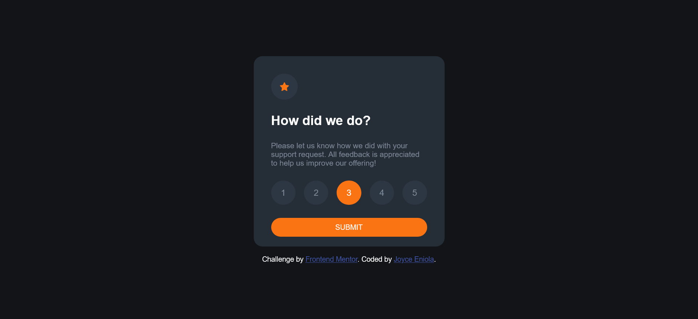
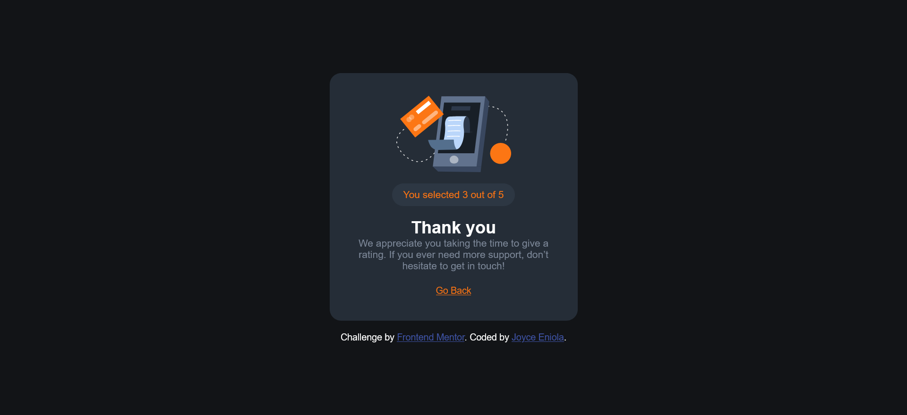

# Frontend Mentor - Interactive rating component solution

This is a solution to the [Interactive rating component challenge on Frontend Mentor](https://www.frontendmentor.io/challenges/interactive-rating-component-koxpeBUmI). Frontend Mentor challenges help you improve your coding skills by building realistic projects.

## Table of contents

- [Overview](#overview)
  - [The challenge](#the-challenge)
  - [Screenshot](#screenshot)
  - [Links](#links)
- [My process](#my-process)
  - [Built with](#built-with)
  - [What I learned](#what-i-learned)
  - [Continued development](#continued-development)
  - [Useful resources](#useful-resources)
- [Author](#author)

## Overview

This is a slightly modified solution to the [Interactive rating component challenge on Frontend Mentor](https://www.frontendmentor.io/challenges/interactive-rating-component-koxpeBUmI)

### The challenge

Users should be able to:

- View the optimal layout for the app depending on their device's screen size
- See hover states for all interactive elements on the page
- Select and submit a number rating
- See the "Thank you" card state after submitting a rating
- _Go back to the rating section in case they want to change their rating._

### Screenshot




### Links

- Solution URL: [https://github.com/joycejenny/qr-code-component-main]
- Live Site URL: [Add live site URL here](https://your-live-site-url.com)

## My process

I re-created the Interactive rating component challenge from Frontend Mmentor.

### Built with

- Semantic HTML5 markup
- CSS custom properties
- Flexbox
- Mobile-first workflow
- Javascript

### What I learned

While working on this small component, i was able to learn and understand certain things better.
I gained more understanding of nesting certain HTML elements for example "div" tags.
I was able to further understand the basic parent and child element relationship while adding certain classes and css rules and properties to major aspects of the code in this component. Here's an example of what i am talking about.

```
<div class="rating_section">
        <div class="rating_section_content"><div class="star_icon">
        ...
        ...
      </div>
    </div>

```

Here, when I was writing the code for the CSS, initially I used the "display: flex;" property in the "rating_section" selector, but my major goal was to have it be hidden e.g using the "display: none;" property when a certain click event happens through the Javascript part of the code, but it didn't function the way I wanted it to so I had to think "laterally" and then, added a child class "rating_section_content" so that the overall code could function the way I wanted it to.

I applied this simple technique in two major parts of my HTML and CSS. As a beginner in Web development this was a major breakthrough for me as I have had issues with knowing when and how to nest certain HTML elements but now I am happy I finally got to understand this small concept.

### Continued development

I will be learning more about Javascript to really get the fundamentals and foundations right, and i will be taking on more challenges from frontend Mentor. Frontend mentor has really been a useful resource for me in the past few weeks and i really appreciate the service they render.

### Useful resources

my brain 😏.

## Author

- Joyce Eniola Adedeji
- Github - [https://github.com/joycejenny]
- Frontend Mentor - [https://www.frontendmentor.io/profile/joycejenny]
